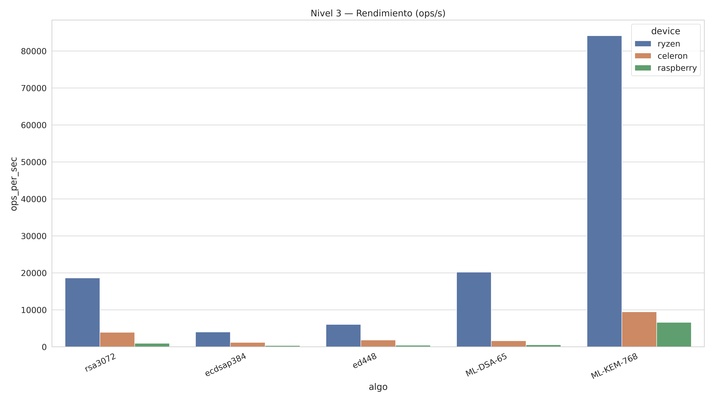
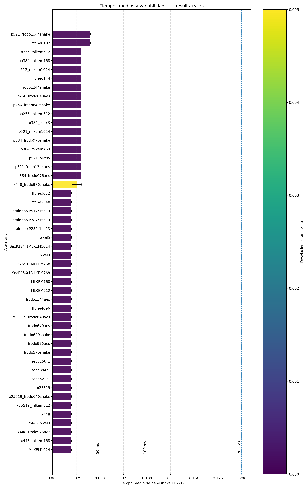

# PQC Benchmark

Reproducible performance benchmarking framework for NIST-standardized post-quantum cryptographic algorithms across heterogeneous hardware environments.

Compares **ML-KEM**, **ML-DSA** (FIPS 203/204, finalized August 2024), and **FrodoKEM** against their classical counterparts — RSA, ECDSA, and EdDSA — on three CPU architectures, measuring throughput, latency, key/signature sizes, and TLS handshake overhead.

This repository accompanies the MSc thesis *"Performance Benchmarking of Post-Quantum Cryptographic Algorithms across Heterogeneous Hardware Environments"* (Universitat Oberta de Catalunya, 2026). [Read the full thesis](https://hdl.handle.net/10609/154216) · [PDF](docs/thesis.pdf)

---

## Why this matters

NIST finalized its first PQC standards in August 2024 (FIPS 203, 204, 205). Every organization handling long-lived sensitive data — banking, healthcare, defense, cloud infrastructure — now faces a migration decision: *which algorithm, on which hardware, with what performance cost?*

This framework provides reproducible measurements across **three real hardware platforms** to inform that decision with concrete data.

---

## Key results



- **ML-KEM-768** (NIST Level 3 KEM) achieves **~92,000 encapsulations/sec** on AMD Ryzen — **40× higher throughput** than RSA-2048 key operations on the same platform.
- **ML-DSA-65** signing at **~11,800 ops/sec** is **5× faster** than RSA-2048 signing (2,270 ops/sec), while providing a stronger security level.
- PQC public keys are **4–18× larger** than classical equivalents (ML-KEM-768: 1,184 B vs ECDH P-256: 64 B) — the main bandwidth cost of migration.
- **TLS hybrid handshakes** (X25519 + ML-KEM-768) add < 10 ms overhead versus classical-only handshakes on x86_64.
- Raspberry Pi 5 (ARM64) sustains **>20,000 ML-KEM-768 encaps/sec** — PQC migration is feasible on constrained embedded hardware.



Full results in [`results/`](results/) · Complete analysis in the [thesis PDF](docs/thesis.pdf).

---

## Quick start

```bash
git clone https://github.com/dpm2448dpm/pqc-benchmark.git
cd pqc-benchmark
pip install -e ".[dev]"

# Reproduce all figures from raw data
python benchmarks/regenerate_all_figures.py
```

Individual plotting scripts:

```bash
# PQC (ML-KEM / ML-DSA) — AMD Ryzen platform
python benchmarks/plot_pqc_results.py results/raw/pqc/ryzen -o results/figures/pqc_ryzen

# Classical algorithms — AMD Ryzen
python benchmarks/plot_classical_results.py results/raw/classical/ryzen -o results/figures/classical_ryzen

# TLS handshake — all platforms
python benchmarks/plot_tls_results.py \
    --ryzen results/raw/tls/ryzen \
    --celeron results/raw/tls/celeron \
    --raspberry results/raw/tls/raspberry

# PQC vs Classical comparison by NIST level
python benchmarks/plot_comparison.py
```

---

## Methodology

- **Timer:** `CLOCK_MONOTONIC` (OpenSSL internal) — nanosecond resolution.
- **Repetitions:** 3 independent runs per (algorithm, platform) pair; each run exercises the algorithm for a 3-second window.
- **Warmup:** OpenSSL speed performs internal calibration before measurement.
- **Memory:** measured via `psutil` RSS delta; all algorithm state fits in L3 cache.
- **Hardware control:** CPU frequency pinned to performance governor; no background load.

Full methodology in [`docs/methodology.md`](docs/methodology.md).

---

## Algorithms covered

| Family | Post-quantum | Classical baseline |
|---|---|---|
| KEM (standalone) | ML-KEM-512/768/1024 (FIPS 203) | ECDH P-256/384/521, X25519 |
| Signatures | ML-DSA-44/65/87 (FIPS 204) | ECDSA P-256/384/521, Ed25519/Ed448, RSA-2048/3072/4096 |
| TLS handshake | ML-KEM hybrids, FrodoKEM-640/976/1344, BIKE L1/L3/L5 | FFDHE, ECDH, X25519 |

Implementations via [OpenSSL 3.x](https://openssl.org) with the [OQS Provider](https://github.com/open-quantum-safe/oqs-provider) and [liboqs](https://github.com/open-quantum-safe/liboqs).

See [`docs/algorithms.md`](docs/algorithms.md) for key sizes and security level mappings.

---

## Hardware tested

| Platform | Architecture | CPU | RAM | OS |
|---|---|---|---|---|
| `ryzen` | x86_64 | AMD Ryzen 7 | 32 GB | Ubuntu 24.04 |
| `celeron` | x86_64 | Intel Celeron N4020 | 4 GB | Ubuntu 22.04 |
| `raspberry` | ARM64 | Raspberry Pi 3 (BCM2712) | 2 GB | Raspberry Pi OS (Debian 12) |

See [`docs/hardware-setups.md`](docs/hardware-setups.md) for full hardware and software details.

---

## Repository structure

```
pqc-benchmark/
├── src/pqc_benchmark/reporting/  # Analysis and plotting library
├── benchmarks/                   # Entry-point scripts (reproduce figures)
├── results/
│   ├── raw/                      # Raw CSV measurements (203 files)
│   │   ├── pqc/{celeron,ryzen,raspberry}/
│   │   ├── classical/{celeron,ryzen,raspberry}/
│   │   └── tls/{celeron,ryzen,raspberry}/
│   ├── processed/                # Aggregated summary CSVs
│   └── figures/                  # Pre-generated PNG figures
├── docs/                         # Methodology, hardware details, thesis PDF
└── tests/                        # Unit tests for the analysis library
```

---

## Reproducibility

- All raw CSV measurements are version-controlled in `results/raw/`.
- Figures can be fully regenerated with `python benchmarks/regenerate_all_figures.py`.
- Hardware metadata logged alongside raw results in `meta_*.txt` files.
- CI runs a reduced validation suite on every commit (GitHub Actions).

---

## Citation

```bibtex
@mastersthesis{perez2026pqcbenchmark,
  author  = {Pérez Martín, Darío},
  title   = {Performance Benchmarking of Post-Quantum Cryptographic Algorithms
             across Heterogeneous Hardware Environments},
  school  = {Universitat Oberta de Catalunya},
  year    = {2026},
  url     = {https://hdl.handle.net/10609/154216}
}
```

---

## License

Apache License 2.0 — see [`LICENSE`](LICENSE).

**Author:** Darío Pérez Martín · [dpm24mainstream@proton.me](mailto:dpm24mainstream@proton.me)
